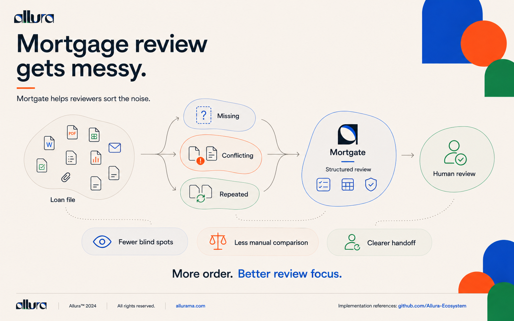
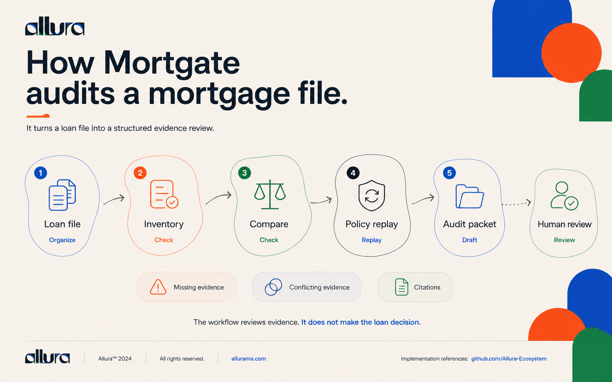
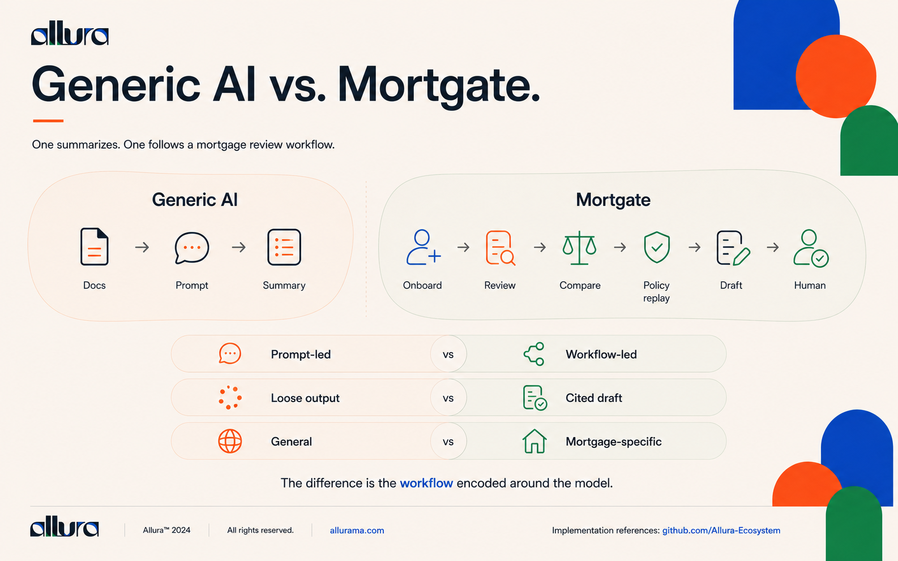

# Mortgate Evidence Review

> [!NOTE]
> **AI-Assisted Documentation**
> Portions of this README were drafted with the assistance of an AI language model and reviewed against the current Cowork package source. Where this README conflicts with the package manifest, skill definitions, or JSON schema, those sources control.

**Mortgate is a specialized mortgage evidence-review capability you install into an AI workspace you already use** — not another mortgage SaaS platform. The canonical product source is [`microsoft-cowork/`](microsoft-cowork/), a native Microsoft Copilot Cowork skills package.

Mortgate helps an authorized employee inventory supplied loan-file documents, identify missing or conflicting evidence, compare a supplied deterministic policy replay, and draft an audit packet. It does **not** approve or deny credit, set pricing, issue notices, contact borrowers, or write to a loan system of record.

> [!IMPORTANT]
> ADR-36 made the Microsoft Copilot Cowork package the entire current product on 2026-08-28. The Salesforce/Veridact implementation under [`force-app/`](force-app/) is retained only as historical evidence and is not supported for new development or deployment.

## What Mortgate is — and is not

**Traditional mortgage software:**

```text
Employee → new website → new login → new UI → vendor database → new workflow
```

**Mortgate:**

```text
Employee → existing AI coworker → install Mortgate → review mortgage files
```

Mortgate sells the **mortgage expertise and review procedure**, not an application:

- **No separate SaaS dashboard** — no extra application for employees to learn.
- **No new AI model** — Mortgate uses the intelligence of the host workspace.
- **No application backend for the current read-only design** — no live connector, credential store, database, or lending decision engine.
- **The workflow travels with the user** — the employee hands the AI the loan documents and invokes the review capability where they already work.
- **Lower adoption friction** — IT approves a focused capability package rather than replacing the LOS or deploying another mortgage platform.
- **Host-native tools become Mortgate's tools** — Cowork already works across files and multi-step tasks; the skills add specialized domain expertise.
- **Much smaller security surface** — read-only by design; no write access into a production loan system.
- **Easy specialization** — improve the methodology without rebuilding a product UI.
- **Composable** — other skills work beside Mortgate rather than every capability living inside one giant application.

### The moat is the workflow

A generic AI session can read PDFs. Mortgate tells the host **what to look for, in what order, how to compare it, what it must not do, what evidence it must retain, and what artifact to hand back to the reviewer**:

```text
Case onboarding
→ Document inventory
→ Evidence comparison
→ Gap detection
→ Conflict detection
→ Policy replay
→ Citations
→ Audit packet
→ Human decision
```

### One capability, multiple AI workspaces

```text
                 MORTGATE
       Mortgage Review Methodology
                    │
          ┌─────────┼─────────┐
          ↓         ↓         ↓
       Cowork    ChatGPT    Codex
          │         │         │
          └─────────┼─────────┘
                    ↓
          Supplied Mortgage File
                    ↓
        Structured Evidence Review
                    ↓
            Cited Audit Packet
                    ↓
              HUMAN REVIEW
```

> [!NOTE]
> **Microsoft Copilot Cowork is the current canonical product** (ADR-36). The ChatGPT/Codex surfaces above are the architecture and product-strategy direction — they are not shipped until the corresponding packaging actually lands in this repository.

### The pitch

> Don't buy another mortgage AI platform. Upgrade the AI workspace you already have.

Ocrolus, LoanLogics, and similar vendors sell systems. Mortgate sells **capability**: **no new SaaS · no new workflow · no automated credit decision**.

## Mortgate, explained visually

These three product explainers tell the product story in order: the evidence-review problem, the current workflow, and the difference between a reusable mortgage-review procedure and a generic AI conversation. They are conceptual illustrations—not screenshots—and do not expand the current Cowork package's scope.

### 1. Mortgage review gets messy

Loan files can contain missing, conflicting, and repeated material. Mortgate helps reviewers organize that evidence into a structured review and hand it to a human reviewer with fewer blind spots and less manual comparison.



### 2. How Mortgate audits a mortgage file

The current Cowork workflow turns an attached loan file into a human-review draft: document inventory, evidence comparison, comparison with a *supplied* deterministic policy replay, and a cited audit packet. It flags missing and conflicting evidence; **it does not make the loan decision**.



### 3. A workflow, not just a prompt

Generic AI can summarize a document in response to a prompt. Mortgate provides a reusable mortgage-review workflow around the host AI: onboarding, evidence review, comparison, supplied policy replay, a cited draft, and human review.



## Product at a glance

| Surface | Status | Purpose |
|---|---|---|
| [`microsoft-cowork/appPackage/`](microsoft-cowork/appPackage/) | **Current product** | Microsoft 365 app manifest, icons, and four Agent Skills |
| [`microsoft-cowork/scripts/validate_package.py`](microsoft-cowork/scripts/validate_package.py) | **Current validator** | Offline package and archive validation |
| [`catalog-export.json`](catalog-export.json) | **Canonical export contract** | Exact allowlist for a future generated catalog package |
| [`mortagate-cowork.gates.json`](mortagate-cowork.gates.json) | **Current gates** | Cowork product readiness checks |
| [`force-app/`](force-app/) and `mortagate.gates.json` | **Deprecated legacy** | Historical Salesforce/Veridact implementation and its former gates |

The four current skills are:

- `mortgage-case-onboarding`
- `loan-file-evidence-review`
- `policy-replay-review`
- `audit-packet-draft`

## Install

This repository is the canonical standalone source. Validate and package it locally:

```bash
python3 microsoft-cowork/scripts/validate_package.py \
  --package-root microsoft-cowork/appPackage

cd microsoft-cowork
npx --yes @microsoft/m365agentstoolkit-cli package \
  --manifest-file appPackage/manifest.json \
  --output-package-file dist/mortgate-evidence-review.zip \
  --interactive false
```

For private upload and tenant requirements, see [Installation](docs/INSTALLATION.md). Copilot Cowork is a Frontier preview, so a licensed human and a suitable tenant are required for the final upload gate.

## Validate

```bash
npm run validate:cowork
npm run validate:export
npm run test:catalog-export
npm run docs:links
```

The complete local and tenant validation matrix is in [Validation](docs/VALIDATION.md).

## Architecture and configuration

- [Architecture](docs/ARCHITECTURE.md)
- [Installation](docs/INSTALLATION.md)
- [Configuration](docs/CONFIGURATION.md)
- [Validation](docs/VALIDATION.md)
- [Ecosystem relationships](docs/ECOSYSTEM.md)
- [Legacy Salesforce/Veridact record](docs/LEGACY-SALESFORCE.md)
- [ADR-36](planning%20docs/RISKS-AND-DECISIONS.md#adr-36--platform-pivot-mortagate-is-a-microsoft-copilot-cowork-plugin-only-salesforce-is-deprecated)

## Canonical source and future catalog package

This repository remains authoritative for Mortgate product content. [`catalog-export.json`](catalog-export.json) defines the only files eligible for a later generated export into [`allura-plugins/packages/mortagate-cowork`](https://github.com/Allura-Ecosystem/allura-plugins/tree/main/packages/mortagate-cowork). That destination is a **future install path**, not a current published package. Do not edit a generated catalog copy as source, and do not write into `allura-plugins` from this repository's exporter validation.

## Ecosystem

Mortgate is a product repository, not a replacement for shared ecosystem services:

- [Allura Memory](https://github.com/Allura-Ecosystem/Allura_Memory) provides optional governed memory infrastructure; the employee-facing Cowork skills remain memory-free.
- [allura-plugins](https://github.com/Allura-Ecosystem/allura-plugins) is the future generated catalog consumer; Mortgate remains canonical.
- [Team RAM](https://github.com/Allura-Ecosystem/allura-team-ram) may provide the internal engineering harness; it has no mortgage decision authority.
- [Team Durham](https://github.com/Allura-Ecosystem/team-durham) may govern brand production; it does not govern evidence findings or releases.

See [Ecosystem relationships](docs/ECOSYSTEM.md) for both directions of each relationship and degraded behavior.

## Historical Salesforce evidence

The deprecated Veridact/Salesforce implementation is intentionally preserved so prior work and validation claims remain auditable. Historical claims are date-scoped, not current operational claims. See [Legacy Salesforce/Veridact record](docs/LEGACY-SALESFORCE.md) and the warning in [`force-app/README.md`](force-app/README.md).

## License

Proprietary. All rights reserved. © Allura Ecosystem.
