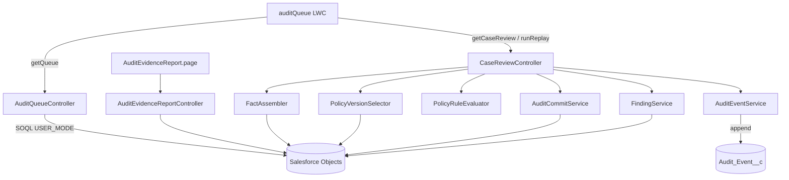
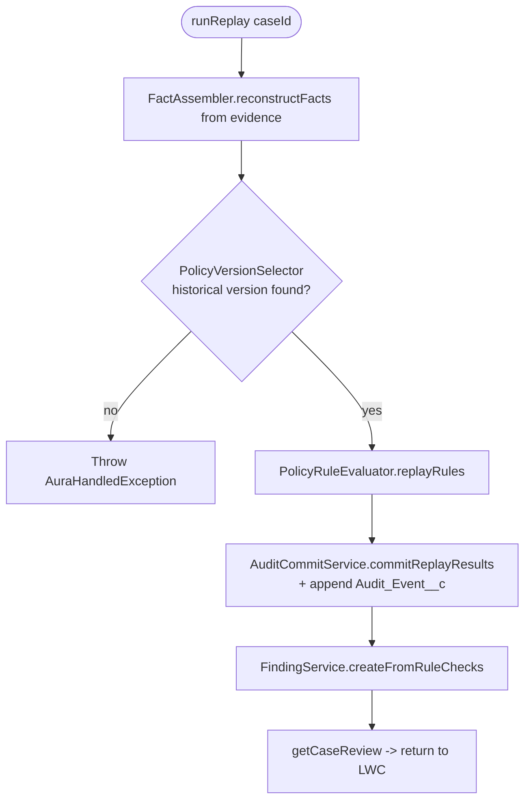
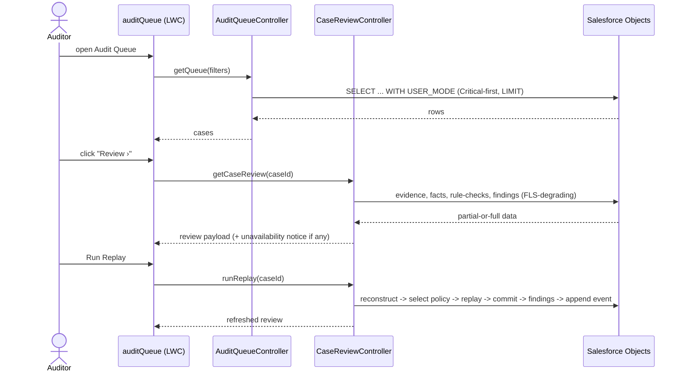
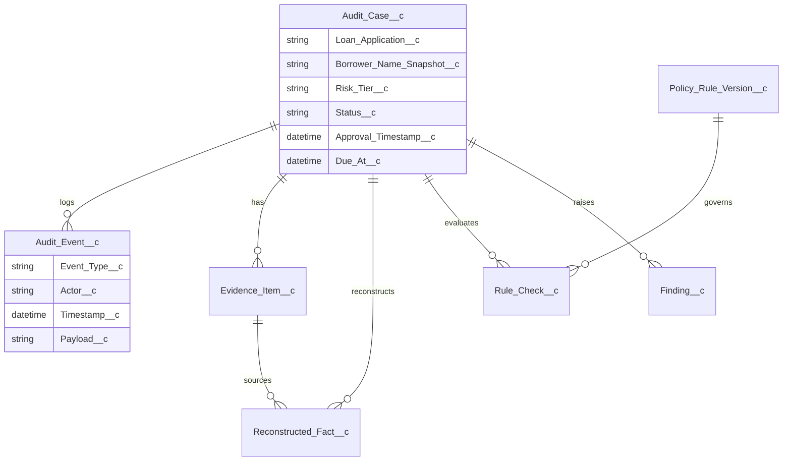
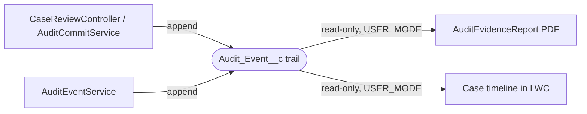

# Audit Queue Blueprint

> [!NOTE]
> **AI-Assisted Documentation**
> Portions of this document were drafted with the assistance of an AI language model (GitHub Copilot).
> Content has not yet been fully reviewed — this is a working design reference, not a final specification.
> AI-generated content may contain inaccuracies or omissions.
> When in doubt, defer to the source code, JSON schemas, and team consensus.

The **Audit Queue** is a Salesforce application for mortgage loan **quality-control (QC) auditors**. A reviewer opens a prioritized queue of sampled loan approvals, filters it, and opens an individual case to inspect its evidence, reconstructed facts, policy rule-checks, and findings — then *replays* the original lending decision against the policy version that was in force at approval time, all recorded on an immutable, append-only audit trail. It runs in the `mortagate-de` Salesforce org and is built from a Lightning Web Component front end over an Apex service layer.

---

## Table of Contents

- [1) Core Concepts](#1-core-concepts)
- [2) Requirements](#2-requirements)
  - [Business Requirements](#business-requirements)
  - [Functional Requirements](#functional-requirements)
- [3) Architecture](#3-architecture)
  - [Components](#components)
- [4) Diagrams](#4-diagrams)
  - [Component Overview](#component-overview)
  - [Execution Flow](#execution-flow)
  - [Sequence Diagram](#sequence-diagram)
  - [Data Model (ER Diagram)](#data-model-er-diagram)
  - [Event-Driven Architecture](#event-driven-architecture-diagram)
- [5) Data Model](#5-data-model)
- [6) Execution Rules](#6-execution-rules)
- [7) Global Constraints](#7-global-constraints)
- [8) API Surface](#8-api-surface)
- [9) Logging & Audit](#9-logging--audit)
- [10) Admin Workflow](#10-admin-workflow)
- [11) Event-Driven Architecture](#11-event-driven-architecture)
- [12) References](#12-references)

---

## 1) Core Concepts

### Audit Case (`Audit_Case__c`)
A single loan approval selected for QC review. Created when a loan is sampled; carries the point-in-time borrower identity, the risk tier, the assigned auditor, SLA timestamps, and the policy version resolved for replay.

**States (`Status__c`):** `Created → Assigned → In_Review → Ready_for_Signoff → Closed` (plus `Evidence_Needed`).

**Key fields:** `Loan_Application__c`, `Borrower_Name_Snapshot__c` (write-once), `Risk_Tier__c`, `Auditor__c`, `Original_Approver__c`, `Sampling_Reason__c`, `Approval_Timestamp__c`, `Due_At__c`, `Policy_Version__c`.

---

### Audit Event (`Audit_Event__c`)
An immutable entry in the case's chain-of-custody trail. Appended whenever something material happens (facts reconstructed, replay executed, evidence status changed, sign-off). Never edited, never deleted.

**Key fields:** `Audit_Case__c`, `Event_Type__c`, `Actor__c`, `Timestamp__c`, `Payload__c`, `Related_Record_Id__c`.

---

### Evidence Item (`Evidence_Item__c`)
A document attached to (or expected for) a case — W-2, credit report, bank statement, pay stub, appraisal — with a verification status and content hash.

**Key fields:** `Audit_Case__c`, `Document_Type__c`, `Status__c` (`Available`/`Missing`/…), `Required__c`, `SHA256_Hash__c`, `Received_Timestamp__c`.

---

### Reconstructed Fact (`Reconstructed_Fact__c`)
A fact (DTI, credit score, loan amount, income, …) rebuilt from evidence at audit time so the original decision can be replayed deterministically.

**Key fields:** `Audit_Case__c`, `Fact_Type__c`, `Value__c`, `Source_Evidence__c`, `Is_Unverifiable__c`, `Unverifiable_Reason__c`, `Confidence__c`.

---

### Policy Rule Version (`Policy_Rule_Version__c`)
A versioned, effective-dated policy rule set. The replay must use the version **in force at the loan's approval date**, not today's.

**Key fields:** `Status__c`, `Effective_Date__c`, `DTI_Threshold__c`, `Min_Credit_Score__c`, `HITL_Credit_Threshold__c`, `Max_Loan_No_Escalation__c`, `Version_Number__c`, `Supersedes__c`/`Superseded_By__c`.

---

### Rule Check (`Rule_Check__c`)
The outcome of evaluating one policy rule against the reconstructed facts during replay.

**Key fields:** `Audit_Case__c`, `Rule_Name__c`, `Outcome__c` (`Pass`/`Violation`/`Exception`/`Unverifiable`), `Policy_Rule_Version__c`, `Rationale__c`, `Exception_Reason__c`, `Exception_Approver__c`.

---

### Finding (`Finding__c`)
A defect raised from a failed rule-check (violation, unverifiable, or unapproved exception), with category, severity, disposition, and remediation owner.

**Key fields:** `Audit_Case__c`, `Category__c`, `Severity__c`, `Disposition__c`, `Rationale__c`, `Remediation_Owner__c`, `Remediation_Due_At__c`.

---

## 2) Requirements

### Business Requirements

| # | Requirement |
|---|-------------|
| B1 | A QC auditor can view a prioritized queue of sampled loan audits. |
| B2 | An auditor can filter and sort the queue to find the cases they must work. |
| B3 | An auditor can open a case and inspect its evidence, facts, rule-checks, findings, and full event trail. |
| B4 | An auditor can replay the original lending decision against the policy version in force at approval time. |
| B5 | The system produces a regulator-presentable, immutable evidence report. |
| B6 | All audit activity is recorded in an immutable, append-only trail. |
| B7 | A reviewer cannot audit a loan they themselves approved (independence). |

---

### Functional Requirements

#### Queue (list view)

| # | Requirement |
|---|-------------|
| F1 | `getQueue` returns audit cases with loan #, borrower (from the write-once snapshot), risk tier, status, assigned approver, and SLA. |
| F2 | Critical-tier cases always surface above the 200-row cap (`ORDER BY Risk_Tier__c DESC`). |
| F3 | The queue is filterable by status, product, branch, approver, risk tier, sampling reason, approval date, due-before, and an All/My-cases toggle. |
| F4 | Rows sort client-side with stable tie ordering; sort fields are allow-list guarded. |
| F5 | All queries are injection-safe (bind variables + hardcoded allow-lists only). |

#### Case review & replay

| # | Requirement |
|---|-------------|
| F6 | `getCaseReview` returns the case's evidence items, reconstructed facts, rule-checks, and findings. |
| F7 | `runReplay` reconstructs facts from evidence, selects the historical policy version, replays the rules, commits the results, and creates findings from failed checks. |
| F8 | `updateEvidenceStatus` records a change to an evidence item's verification status. |
| F9 | `getTimeline` returns the append-only `Audit_Event__c` trail ordered by `Timestamp__c`. |
| F10 | Case-review reads degrade gracefully when an optional field is not FLS-readable, returning partial data plus a visible "some fields unavailable" notice (see [AD-01](RISKS-AND-DECISIONS.md#ad-01-fls-gap-closed-by-graceful-degradation-not-a-permission-set)). |

#### Integrity controls

| # | Requirement |
|---|-------------|
| F11 | `Audit_Event__c` is append-only — no update (VR `Prevent_Edit_After_Creation`), no delete (trigger `AuditEventPreventDelete`). |
| F12 | `Borrower_Name_Snapshot__c` is write-once (VR `Snapshot_Write_Once`); blank→value first capture allowed. |
| F13 | A reviewer cannot be assigned to audit their own approval (VR `Prevent_Self_Audit`). |

#### Reporting

| # | Requirement |
|---|-------------|
| F14 | A Visualforce PDF evidence report renders the case identity + chain-of-custody, FLS-safe and default-escaped (no `escape="false"`). |

---

## 3) Architecture

### Components

| Component | Responsibility | Notes |
|-----------|---------------|-------|
| `auditQueue` (LWC) | Queue UI: stat cards, filter bar, sortable datatable with risk sigils | Front end; Jest-tested; targets `lightning__AppPage`/`lightning__RecordPage` |
| `AuditQueueController` (Apex) | `getQueue` — builds the filtered, injection-safe, Critical-first query | `with sharing`; bind vars + allow-lists |
| `CaseReviewController` (Apex) | Orchestrates case detail (`getCaseReview`), `runReplay`, `updateEvidenceStatus`, `getTimeline` | Graceful FLS degradation (AD-01) |
| `AuditCaseService` (Apex) | Audit-case lifecycle operations | Service layer |
| `AuditEventService` (Apex) | Append events; `getEventsForCase` (USER_MODE, runAs-proven) | Append-only enforcement support |
| `FactAssembler` (Apex) | Reconstructs facts from evidence (`reconstructFacts`/`…Bulk`) | Dynamic SOQL + try/catch idiom |
| `PolicyVersionSelector` (Apex) | Resolves the historical policy version by approval date | FLS-degrading reads (AD-01) |
| `PolicyRuleEvaluator` (Apex) | `replayRules` — evaluates facts against the policy version | **Co-owned engine class** (org / PR clone); excluded from the audit package |
| `AuditCommitService` (Apex) | Persists replay facts + rule-checks; logs events | Replay kernel (org / PR clone) |
| `FindingService` (Apex) | Maps failed rule-checks → findings | FLS-degrading reads (AD-01) |
| `AuditEvidenceReportController` + `AuditEvidenceReport.page` | PDF evidence report | `renderAs="pdf"`, default-escaped |
| `AuditEventPreventDelete` (trigger) | Blocks deletion of audit events | Integrity control |

---

## 4) Diagrams

### Component Overview

### Execution Flow

Replay of a single case (the core multi-step operation, F7):

### Sequence Diagram

Auditor loads the queue, opens a case, runs replay:

### Data Model (ER Diagram)

### Event-Driven Architecture (diagram)

---

## 5) Data Model

> Full field-level detail (types, required flags, enum values) is in [DATA-DICTIONARY.md](DATA-DICTIONARY.md). The tables below summarize the audit-queue core entities.

### `Audit_Case__c`
The loan approval under review. See [Data Dictionary](DATA-DICTIONARY.md#audit_case__c).

| Field | Type | Required | Description |
|-------|------|----------|-------------|
| `Loan_Application__c` | Text/Lookup | Yes | The loan under audit |
| `Borrower_Name_Snapshot__c` | Text | No | Write-once borrower identity at audit time |
| `Risk_Tier__c` | Picklist | Yes | Critical / High / Medium / Low |
| `Status__c` | Picklist | Yes | Lifecycle state |
| `Auditor__c` | Lookup(User) | No | Assigned reviewer |
| `Original_Approver__c` | Lookup(User) | No | Who approved the loan |
| `Approval_Timestamp__c` | DateTime | No | Drives historical policy selection |
| `Due_At__c` | DateTime | No | SLA deadline |

### `Audit_Event__c`
Append-only chain-of-custody. See [Data Dictionary](DATA-DICTIONARY.md#audit_event__c).

| Field | Type | Required | Description |
|-------|------|----------|-------------|
| `Audit_Case__c` | Master/Lookup | Yes | Parent case |
| `Event_Type__c` | Picklist/Text | Yes | What happened |
| `Actor__c` | Text/Lookup | Yes | Who/what acted |
| `Timestamp__c` | DateTime | Yes | When |
| `Payload__c` | Long Text | No | Structured detail |

---

## 6) Execution Rules

### Effective Definition Resolution
Replay resolves the policy via `PolicyVersionSelector.selectByApprovalDate(approvalTimestamp)` → the `Policy_Rule_Version__c` whose effective window contains the loan's `Approval_Timestamp__c`. If none resolves, replay aborts with an `AuraHandledException` (no silent default).

### Eligibility Rules
A case is replayable when it has reconstructable evidence and a resolvable historical policy version. A reviewer must not be the case's `Original_Approver__c` (F13).

### Failure Semantics
`runReplay` is **not** transactional across all stages by guideline — *failure semantics are a team decision (see [AD-01](RISKS-AND-DECISIONS.md)) and must not be set by AI alone.* Current behavior: a missing optional field degrades gracefully (partial data + notice); a missing policy version aborts the replay.

### Retry Semantics
No automatic retry. The auditor re-invokes `runReplay` manually.

### Cancellation
Not applicable — replay is a synchronous operation, not a long-running job.

---

## 7) Global Constraints

- `Audit_Event__c` is immutable: no UPDATE (VR `Prevent_Edit_After_Creation`), no DELETE (trigger `AuditEventPreventDelete`). (F11)
- `Borrower_Name_Snapshot__c` is write-once. (F12)
- A reviewer cannot audit their own approval. (F13)
- Read SOQL on the audit/evidence surface runs `WITH USER_MODE`; optional FLS-blocked fields degrade, never leak. (AD-06, AD-01)
- Dynamic SOQL uses bind variables + hardcoded allow-lists only — no string interpolation of user input. (F5)

---

## 8) API Surface

> Apex `@AuraEnabled` methods (the LWC's server interface), grouped by controller. Full signatures in [DESIGN-AUDIT-QUEUE.md](DESIGN-AUDIT-QUEUE.md#api-reference).

### Queue

| Method | Controller | Description |
|--------|------------|-------------|
| `getQueue(filters)` | `AuditQueueController` | Filtered, Critical-first, capped list of audit cases |

### Case review

| Method | Controller | Description |
|--------|------------|-------------|
| `getCaseReview(caseId)` | `CaseReviewController` | Evidence + facts + rule-checks + findings (FLS-degrading) |
| `runReplay(caseId)` | `CaseReviewController` | Reconstruct → select policy → replay → commit → findings |
| `updateEvidenceStatus(...)` | `CaseReviewController` | Update an evidence item's status |
| `getTimeline(caseId)` | `CaseReviewController` / `AuditEventService` | Append-only event trail |

---

## 9) Logging & Audit

| What | Where stored | Notes |
|------|-------------|-------|
| Chain-of-custody events | `Audit_Event__c` | Append-only; read via USER_MODE; surfaced in the case timeline + PDF report |
| Replay results | `Reconstructed_Fact__c`, `Rule_Check__c` | Persisted by `AuditCommitService` |
| Findings | `Finding__c` | Raised from failed rule-checks |
| Fix-B degradation events | Apex debug log | Named `System.debug` on each FLS-degrade path (RK-01 mitigation) |

**Redacted fields:** No secrets/credentials are stored by this service. Borrower identity is intentionally snapshotted (`Borrower_Name_Snapshot__c`) for audit fidelity; FLS via USER_MODE governs who can read PII-adjacent fields. *What additional fields, if any, must be redacted from the PDF/report is a security-boundary decision reserved for the team (per AI-GUIDELINES §3).* 

---

## 10) Admin Workflow

1. Sample loan approvals into `Audit_Case__c` (sampling reason + risk tier set).
2. Assign an auditor (respecting self-audit independence, F13).
3. Auditor opens the **Audit Queue** from the App Launcher.
4. Filter/sort to the cases due; open a case ("Review ›").
5. Inspect evidence; update evidence status as documents are verified.
6. Run replay to reproduce the original decision against the historical policy.
7. Review generated findings; drive remediation.
8. Move the case to Ready-for-Signoff → Closed; generate the PDF evidence report.

---

## 11) Event-Driven Architecture

The service is event-*logged*, not event-*bus* driven. Every material state change appends an immutable `Audit_Event__c` record; there is no external pub/sub topic. Full payload field definitions are in [DATA-DICTIONARY.md](DATA-DICTIONARY.md#audit_event__c).

**Producer (all events):** `CaseReviewController` / `AuditCommitService` / `AuditEventService`
**Consumer(s):** the case timeline (LWC) and the PDF evidence report — both read-only, USER_MODE.

| Event | Trigger |
|-------|---------|
| `Facts_Reconstructed` | `runReplay` reconstructs facts from evidence |
| `Replay_Executed` | `PolicyRuleEvaluator.replayRules` completes and results commit |
| `Evidence_Status_Changed` | `updateEvidenceStatus` |
| `Signed_Off` | Case moves to Closed / sign-off recorded |

---

## 12) References

### Project Documents
- [RISKS-AND-DECISIONS.md](RISKS-AND-DECISIONS.md)
- [DESIGN-AUDIT-QUEUE.md](DESIGN-AUDIT-QUEUE.md)
- [REQUIREMENTS-MATRIX.md](REQUIREMENTS-MATRIX.md)
- [SOLUTION-ARCHITECTURE.md](SOLUTION-ARCHITECTURE.md)
- [DATA-DICTIONARY.md](DATA-DICTIONARY.md)

### MVP Goal
- `ralph/goals/goal-20260612-mvp-outcomes.md`

### External Resources
- Salesforce Lightning Design System (SLDS) — Figma Community kit (styling reference)
