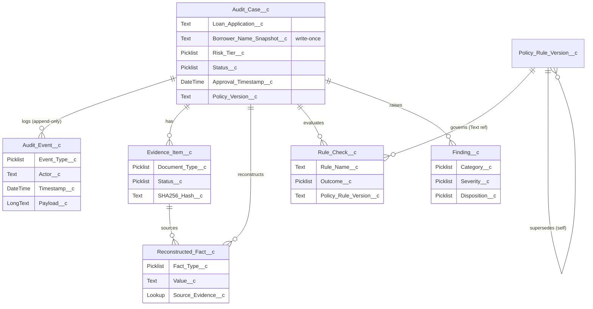

# Data Dictionary: Audit Queue

> [!NOTE]
> **AI-Assisted Documentation**
> Portions of this document were drafted with the assistance of an AI language model.
> Content has not yet been fully reviewed — this is a working design reference, not a final specification.

This is the **canonical field-level reference** for the **Audit Queue** (mortgage loan-QC audit workflow on Salesforce, org `mortagate-de`). Field API names, types, required flags, and picklist values below are taken directly from the `*.field-meta.xml` metadata. No field name in this document is invented; where a control exists in the UI but has no backing field, it is flagged `TBD — confirm in org`.

**See also:** [BLUEPRINT.md](BLUEPRINT.md) · [REQUIREMENTS-MATRIX.md](REQUIREMENTS-MATRIX.md) · [SOLUTION-ARCHITECTURE.md](SOLUTION-ARCHITECTURE.md) · [DESIGN-AUDIT-QUEUE.md](DESIGN-AUDIT-QUEUE.md) · [RISKS-AND-DECISIONS.md](RISKS-AND-DECISIONS.md)

---

## Table of Contents

- [1. Entity-Relationship Diagram](#1-entity-relationship-diagram)
- [2. `Audit_Case__c`](#2-audit_case__c)
- [3. `Audit_Event__c`](#3-audit_event__c)
- [4. `Evidence_Item__c`](#4-evidence_item__c)
- [5. `Reconstructed_Fact__c`](#5-reconstructed_fact__c)
- [6. `Rule_Check__c`](#6-rule_check__c)
- [7. `Finding__c`](#7-finding__c)
- [8. `Policy_Rule_Version__c`](#8-policy_rule_version__c)
- [9. Relationship Notes](#9-relationship-notes)

---

## 1. Entity-Relationship Diagram

`Audit_Case__c` is the hub. Five children reference it directly; `Rule_Check__c` additionally references `Policy_Rule_Version__c` (as a Text(18) reference, not a true lookup — see notes), and `Reconstructed_Fact__c` references `Evidence_Item__c` for provenance.

---

## 2. `Audit_Case__c`

A single loan approval selected for QC review — the hub entity. Carries point-in-time borrower identity, risk tier, the assigned auditor, SLA timestamps, and the policy version resolved for replay. Backs the queue list and the case-review header. See [DESIGN-AUDIT-QUEUE.md](DESIGN-AUDIT-QUEUE.md#5-state-machine) for the `Status__c` lifecycle.

| Field API Name | Type | Required | Description |
|----------------|------|----------|-------------|
| `Approval_Timestamp__c` | DateTime | Yes | Original loan approval timestamp. Drives historical policy-version selection during replay. |
| `Assigned_At__c` | DateTime | No | When the auditor was assigned to this case. |
| `Auditor__c` | Lookup(User) | No | The assigned reviewer. Must not equal `Original_Approver__c` (VR `Prevent_Self_Audit`, F13). |
| `Borrower_Name_Snapshot__c` | Text(121) | No | Point-in-time borrower name captured at `Sampled_At__c`. **Write-once** (VR `Snapshot_Write_Once`, F12 / AD-04); never derived live. |
| `Due_At__c` | DateTime | No | Audit completion deadline (SLA). |
| `Loan_Application__c` | Text(18) | Yes | The approved loan under audit. Stored as an 18-char reference ID until `Loan_Application__c` object is deployed. |
| `Original_Approver__c` | Lookup(User) | No | The user who originally approved the loan. |
| `Policy_Version__c` | Text(18) | No | Reference to the historical `Policy_Rule_Version__c` active at approval. Stored as Text(18), not a true lookup. |
| `Risk_Tier__c` | Picklist | No | Risk classification. Values: `Low`, `Medium`, `High`, `Critical`. |
| `Sampled_At__c` | DateTime | No | Timestamp t0 at which snapshot fields were captured (point-in-time the evidence reflects). |
| `Sampling_Reason__c` | Picklist | Yes | Why the loan was selected. Values: `Random`, `Risk_Based`, `Targeted`, `Ad_Hoc`. |
| `Scope__c` | TextArea | No | Free-text description of the audit scope. |
| `Signed_Off_At__c` | DateTime | No | Timestamp of final sign-off. |
| `Signed_Off_By__c` | Lookup(User) | No | The reviewer who signed off the completed audit. |
| `Status__c` | Picklist | Yes | Current lifecycle stage. Default `Created`. Values below. |

### `Risk_Tier__c` values

| Value | Meaning |
|-------|---------|
| `Low` | Lowest-priority sampling tier. |
| `Medium` | Routine review priority. |
| `High` | Elevated-risk loan; surfaced above the 200-row cap (F2). |
| `Critical` | Highest-risk; always surfaces first (`ORDER BY Risk_Tier__c DESC`). |

### `Sampling_Reason__c` values

| Value | Meaning |
|-------|---------|
| `Random` | Random statistical sample. |
| `Risk_Based` | Selected by a risk model. |
| `Targeted` | Deliberately targeted review. |
| `Ad_Hoc` | One-off / manual selection. |

### `Status__c` values

| Value | Meaning |
|-------|---------|
| `Created` | Case sampled, not yet assigned (default). |
| `Assigned` | An auditor is assigned (set by `AuditCaseService.assignCase`). |
| `In_Review` | Active review in progress. |
| `Evidence_Needed` | Awaiting required evidence. |
| `Ready_For_Signoff` | Replay complete, exceptions resolved (set by `CaseReviewController.submitForSignoff`). |
| `Closed` | Sign-off complete; excluded from the default queue. |

---

## 3. `Audit_Event__c`

An immutable, append-only entry in the case's chain-of-custody trail. Appended whenever something material happens. **Never edited** (VR `Prevent_Edit_After_Creation`) and **never deleted** (trigger `AuditEventPreventDelete`) — F11 / AD-05. Written exclusively through `AuditEventService.logEvent` / `logEvents`.

| Field API Name | Type | Required | Description |
|----------------|------|----------|-------------|
| `Actor__c` | Text(18) | Yes | User ID of the actor, or `SYSTEM` for automated actions. |
| `Audit_Case__c` | Lookup(Audit_Case__c) | Yes | Parent audit case. |
| `Event_Type__c` | Picklist | Yes | Classification of the event (values below). |
| `Payload__c` | Long Text Area(32768) | No | JSON payload with event-specific details; structure varies by `Event_Type__c`. |
| `Related_Record_Id__c` | Text(18) | No | Polymorphic text reference to any related record (`Evidence_Item__c`, `Finding__c`, `Rule_Check__c`, etc.). |
| `Timestamp__c` | DateTime | Yes | When the event occurred. Timeline reads order by this ascending. |

### `Event_Type__c` values

| Value | Emitted by |
|-------|-----------|
| `Case_Created` | `AuditCaseService.createFromLoan` / `createFromLoans` |
| `Case_Assigned` | `AuditCaseService.assignCase` |
| `Evidence_Linked` | `CaseReviewController.updateEvidenceStatus` |
| `Facts_Reconstructed` | Replay pipeline (fact reconstruction stage) |
| `Replay_Executed` | Replay pipeline (commit stage) |
| `Finding_Created` | `FindingService.approveException` (and finding generation) |
| `Remediation_Requested` | Remediation workflow (TBD — confirm in org) |
| `Evidence_Submitted` | Evidence submission workflow (TBD — confirm in org) |
| `Signoff_Completed` | `CaseReviewController.submitForSignoff` |
| `Case_Closed` | Case-close workflow (TBD — confirm in org) |
| `Correction` | Correcting append (history is never mutated; AD-05) |

---

## 4. `Evidence_Item__c`

A document attached to (or expected for) a case — W-2, credit report, bank statement, pay stub, appraisal — with a verification status and content hash. New cases are seeded with a "shell" of `Missing` items by `FactAssembler.createEvidenceShell`.

| Field API Name | Type | Required | Description |
|----------------|------|----------|-------------|
| `Audit_Case__c` | Lookup(Audit_Case__c) | Yes | Parent audit case. |
| `ContentDocument_Id__c` | Text(18) | No | 18-char Salesforce ID of the linked `ContentDocument`. |
| `Document_Type__c` | Picklist | Yes | Category of the document (values below). |
| `Received_Timestamp__c` | DateTime | No | When the item was received or captured. |
| `Required__c` | Checkbox | No | Whether the item is required for audit completion. |
| `SHA256_Hash__c` | Text(64) | No | SHA-256 hash for tamper detection and deduplication. |
| `Status__c` | Picklist | Yes | Collection status. Default `Available`. Values below. |

### `Document_Type__c` values

`W2`, `Tax_Return`, `Bank_Statement`, `Pay_Stub`, `ID`, `Credit_Report`, `Appraisal`, `System_Snapshot`, `Other`.

### `Status__c` values

| Value | Meaning |
|-------|---------|
| `Available` | Document present and usable; enables fact provenance linking. |
| `Missing` | Not yet received; renders facts unverifiable. |
| `Incomplete` | Partially received / insufficient. |

---

## 5. `Reconstructed_Fact__c`

A fact (DTI, credit score, loan amount, income, …) rebuilt from evidence at audit time so the original decision can be replayed deterministically. Built (unsaved) by `FactAssembler.reconstructFacts`; provenance linked through `Source_Evidence__c`.

| Field API Name | Type | Required | Description |
|----------------|------|----------|-------------|
| `Audit_Case__c` | Lookup(Audit_Case__c) | Yes | Parent audit case. |
| `Confidence__c` | Number(3,2) | No | Confidence score, 0.00–1.00. |
| `Extractor_Version__c` | Text(50) | No | Version identifier of the extraction logic that produced this fact. |
| `Fact_Type__c` | Picklist | Yes | Category of the fact (values below). |
| `Is_Unverifiable__c` | Checkbox | No | Whether the fact cannot be verified due to missing/insufficient evidence. |
| `Source_Evidence__c` | Lookup(Evidence_Item__c) | No | The evidence item the fact was extracted from (provenance). |
| `Unverifiable_Reason__c` | Text(255) | No | Explanation of why the fact cannot be verified. |
| `Value__c` | Text(255) | Yes | The reconstructed value as text; interpretation depends on `Fact_Type__c`. May be `PENDING_EXTRACTION` or `UNVERIFIABLE` sentinel. |
| `Verified_At__c` | DateTime | No | When the fact was manually verified. |
| `Verified_By__c` | Lookup(User) | No | The user who manually verified the fact. |
| `Verified__c` | Checkbox | No | Whether the fact was manually verified by an auditor. |

### `Fact_Type__c` values

`DTI`, `LTV`, `Credit_Score`, `Annual_Income`, `Employment_Duration`, `Prior_Default`, `Loan_Amount`, `Address_Tenure`.

---

## 6. `Rule_Check__c`

The outcome of evaluating one policy rule against the reconstructed facts during replay.

| Field API Name | Type | Required | Description |
|----------------|------|----------|-------------|
| `Audit_Case__c` | Lookup(Audit_Case__c) | Yes | Parent audit case. |
| `Evidence_References__c` | Long Text Area(32000) | No | JSON array of `Evidence_Item__c` IDs. |
| `Exception_Approver__c` | Text(255) | No | Name or ID of who approved the exception at origination time. |
| `Exception_Reason__c` | Text(255) | No | Reason for a policy exception (if `Outcome__c = Exception`). A blank reason on an Exception raises a Process finding. |
| `Fact_References__c` | Long Text Area(32000) | No | JSON array of `Reconstructed_Fact__c` IDs. |
| `Outcome__c` | Picklist | Yes | Result of the evaluation (values below). |
| `Policy_Rule_Version__c` | Text(18) | Yes | Policy version used for the evaluation. Text ref until a true lookup is deployed. |
| `Rationale__c` | Long Text Area(32768) | No | Explanation of why the rule produced this outcome. |
| `Rule_Name__c` | Text(100) | Yes | Human-readable name of the policy rule evaluated. |

### `Outcome__c` values

| Value | Downstream finding (per `FindingService.createFromRuleChecks`) |
|-------|----------------------------------------------------------------|
| `Pass` | No finding. |
| `Exception` | If `Exception_Reason__c` is blank → `Process` / `High` finding. |
| `Violation` | `Eligibility` / `High` finding. |
| `Unverifiable` | `Documentation` / `Medium` finding. |

---

## 7. `Finding__c`

A defect raised from a failed rule-check (violation, unverifiable, or unapproved exception), with category, severity, disposition, and remediation owner.

| Field API Name | Type | Required | Description |
|----------------|------|----------|-------------|
| `Audit_Case__c` | Lookup(Audit_Case__c) | Yes | Parent audit case. |
| `Category__c` | Picklist | Yes | Domain classification of the finding (values below). |
| `Closed_Reason__c` | Text(255) | No | Explanation of why the finding was closed. |
| `Disposition__c` | Picklist | Yes | Remediation status. Default `Open`. Values below. |
| `Rationale__c` | Long Text Area(32000) | No | Explanation supporting the finding. |
| `Remediation_Due_At__c` | DateTime | No | Deadline for completing remediation. |
| `Remediation_Owner__c` | Lookup(User) | No | The user responsible for remediation. |
| `Severity__c` | Picklist | Yes | Impact severity (values below). |

### `Category__c` values

`Documentation`, `Eligibility`, `Process`, `Fair_Lending`, `Other`.

### `Disposition__c` values

`Open`, `In_Remediation`, `Ready_For_Signoff`, `Closed`.

### `Severity__c` values

`Low`, `Medium`, `High`, `Critical`.

---

## 8. `Policy_Rule_Version__c`

A versioned, effective-dated policy rule set. Replay must use the version **in force at the loan's approval date** (resolved by `PolicyVersionSelector.selectByApprovalDate`), not today's.

| Field API Name | Type | Required | Description |
|----------------|------|----------|-------------|
| `Allowed_Values__c` | Long Text Area(32768) | No | Allowed-value set for the rule (used with list operators). |
| `Change_Justification__c` | Long Text Area(32768) | No | Justification recorded when the version changed. |
| `DTI_Threshold__c` | Percent(5,2) | Yes | Maximum debt-to-income ratio allowed under this version. |
| `Effective_Date__c` | Date | No | Date this version becomes/became effective (drives temporal selection). |
| `Expiration_Date__c` | Date | No | Date this version expires. |
| `Fact_Field__c` | Text(255) | Yes | The fact field this rule evaluates against. |
| `HITL_Confidence_Threshold__c` | Percent(5,2) | No | AI-confidence threshold below which human-in-the-loop review is required. |
| `HITL_Credit_Threshold__c` | Number(3,0) | No | Credit-score threshold below which human-in-the-loop review is required. |
| `Is_Active__c` | Checkbox | No | Convenience active flag. |
| `Max_Loan_No_Escalation__c` | Currency(16,2) | No | Maximum loan amount approvable without escalation. |
| `Min_Credit_Score__c` | Number(3,0) | Yes | Minimum credit score required for approval under this version. |
| `Notes__c` | Long Text Area(32000) | No | Free-text notes. |
| `Operator__c` | Picklist | No | Comparison operator. Default `LT`. Values: `LT`, `LTE`, `GT`, `GTE`, `EQ`, `BETWEEN`, `IN_LIST`, `NOT_IN_LIST`. |
| `Override_Justification_Required__c` | Checkbox | No | Whether overriding the rule requires a documented justification. |
| `Override_Permitted__c` | Checkbox | No | Whether the rule may be overridden. |
| `Regulatory_Citation__c` | Text(255) | No | Regulatory citation backing the rule. |
| `Rule_Category__c` | Picklist | No | Default `INCOME`. Values: `INCOME`, `CREDIT`, `COLLATERAL`, `COMPLIANCE`, `FRAUD`. |
| `Rule_Code__c` | Text(50) | Yes | Stable machine code for the rule. |
| `Rule_Explanation__c` | Long Text Area(32768) | No | Plain-language explanation of the rule. |
| `Rule_Label__c` | Text(255) | Yes | Human-readable rule label. |
| `Severity__c` | Picklist | No | Default `HARD_DECLINE`. Values: `HARD_DECLINE`, `SOFT_DECLINE`, `WARNING`, `ADVISORY`. |
| `Status__c` | Picklist | Yes | Lifecycle status. Default `Draft`. Values: `Draft`, `Active`, `Superseded`. |
| `Superseded_By__c` | Text(18) | No | Self-referential text pointer to the replacement version. |
| `Supersedes__c` | Lookup(Policy_Rule_Version__c) | No | The version this one supersedes (self-relationship). |
| `Threshold_High__c` | Number(18,4) | No | Upper bound for `BETWEEN`-style rules. |
| `Threshold_Value__c` | Number(18,4) | No | Generic threshold value for the rule. |
| `Version_Number__c` | Number(4,0) | Yes | Sequential version identifier. |

> [!NOTE]
> Of the threshold fields above, only `DTI_Threshold__c`, `Min_Credit_Score__c`, `HITL_Credit_Threshold__c`, and `Max_Loan_No_Escalation__c` are loaded by `PolicyVersionSelector.loadPolicyVersion` for replay. The remaining fields exist on the object but are not read by the Audit Queue code path inspected.

---

## 9. Relationship Notes

| From → To | Field | Cardinality | Notes |
|-----------|-------|-------------|-------|
| `Audit_Event__c` → `Audit_Case__c` | `Audit_Case__c` | many-to-one | True Lookup. Append-only child trail. |
| `Evidence_Item__c` → `Audit_Case__c` | `Audit_Case__c` | many-to-one | True Lookup. |
| `Reconstructed_Fact__c` → `Audit_Case__c` | `Audit_Case__c` | many-to-one | True Lookup. |
| `Reconstructed_Fact__c` → `Evidence_Item__c` | `Source_Evidence__c` | many-to-one | True Lookup (provenance chain). |
| `Rule_Check__c` → `Audit_Case__c` | `Audit_Case__c` | many-to-one | True Lookup. |
| `Rule_Check__c` → `Policy_Rule_Version__c` | `Policy_Rule_Version__c` | many-to-one | **Text(18) reference**, not a Lookup (per field description: "Text ref until ... deployed as Lookup"). |
| `Finding__c` → `Audit_Case__c` | `Audit_Case__c` | many-to-one | True Lookup. |
| `Audit_Case__c` → `Policy_Rule_Version__c` | `Policy_Version__c` | many-to-one | **Text(18) reference**, not a Lookup. |
| `Audit_Case__c` → `User` | `Auditor__c`, `Original_Approver__c`, `Signed_Off_By__c` | many-to-one | True Lookups to `User`. |
| `Policy_Rule_Version__c` → `Policy_Rule_Version__c` | `Supersedes__c` | self | True Lookup (self-relationship). |

> No JSON-schema files exist for these entities; the source of truth is the Salesforce `*.field-meta.xml` metadata under `force-app/main/default/objects/`. (The AI-GUIDELINES JSON-schema link convention does not apply to this Salesforce-native project.)
