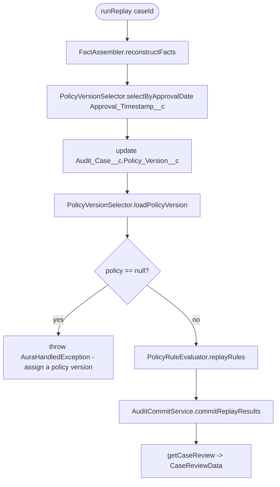
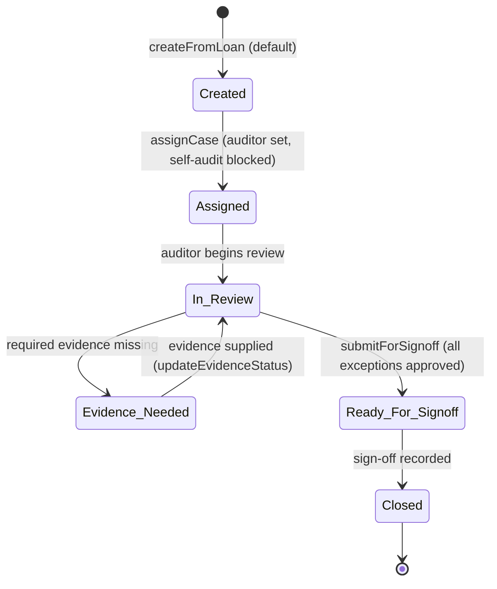

# Design: Audit Queue & Case Review

> [!NOTE]
> **AI-Assisted Documentation**
> Portions of this document were drafted with the assistance of an AI language model.
> Content has not yet been fully reviewed — this is a working design reference, not a final specification.

A deep-dive on the **queue list** and the **case-review (replay)** experience of the Audit Queue. Translates the [Blueprint](BLUEPRINT.md#2-requirements) functional requirements into concrete API contracts, the `Audit_Case__c` state machine, business rules, use cases, and the UI reference.

**See also:** [BLUEPRINT.md](BLUEPRINT.md) · [REQUIREMENTS-MATRIX.md](REQUIREMENTS-MATRIX.md) · [SOLUTION-ARCHITECTURE.md](SOLUTION-ARCHITECTURE.md) · [DATA-DICTIONARY.md](DATA-DICTIONARY.md) · [RISKS-AND-DECISIONS.md](RISKS-AND-DECISIONS.md)

---

## Table of Contents

- [1. Overview](#1-overview)
- [2. Functional Requirement Trace](#2-functional-requirement-trace)
- [3. API Reference](#3-api-reference)
- [4. FLS & Graceful Degradation](#4-fls--graceful-degradation)
- [5. State Machine](#5-state-machine)
- [6. Use Cases](#6-use-cases)
- [7. Business Rules](#7-business-rules)
- [8. UI Reference](#8-ui-reference)
- [9. Important Constraints](#9-important-constraints)

---

## 1. Overview

The Audit Queue has two coupled experiences:

1. **The queue list** — the `auditQueue` LWC on the `Audit_Queue_Page` Lightning App Page. It shows 5 stat cards, a filter bar, and a Critical-first, 200-row-capped datatable of `Audit_Case__c` records. Backed by `AuditQueueController.getQueue` / `getMetrics`.
2. **Case review & replay** — opening a case (e.g. AC-0001) loads its evidence, reconstructed facts, rule-checks, findings, and the append-only event timeline, and lets the auditor *replay* the original decision against the policy version in force at approval time. Backed by `CaseReviewController`.

This document covers F1–F13; the PDF report (F14) is summarized in [REQUIREMENTS-MATRIX.md](REQUIREMENTS-MATRIX.md) and owned by `AuditEvidenceReportController`.

---

## 2. Functional Requirement Trace

| F# | Where implemented here |
|----|------------------------|
| F1 | [`getQueue`](#getqueue) — selects loan #, `Borrower_Name_Snapshot__c`, `Risk_Tier__c`, `Status__c`, approver, SLA. |
| F2 | [`getQueue`](#getqueue) — `ORDER BY Risk_Tier__c DESC, CreatedDate DESC LIMIT 200`; see [§7 Sampling/Prioritization](#7-business-rules). |
| F3 | [`getQueue`](#getqueue) — bind-var WHERE builder; the filter bar in [§8](#8-ui-reference). |
| F4 | Client-side sort in the `auditQueue` LWC (stable tie order; allow-list-guarded sort fields). |
| F5 | [§9](#9-important-constraints) — hardcoded field literals + `:bind` vars + `WITH USER_MODE`. |
| F6 | [`getCaseReview`](#getcasereview) — `CaseReviewData` wrapper. |
| F7 | [`runReplay`](#runreplay) — reconstruct → select policy → replay → commit → findings. |
| F8 | [`updateEvidenceStatus`](#updateevidencestatus) — status change + `Evidence_Linked` event. |
| F9 | [`getTimeline`](#gettimeline) — append-only trail ordered by `Timestamp__c` ASC. |
| F10 | [§4 FLS & Graceful Degradation](#4-fls--graceful-degradation) — Fix B per [AD-01](RISKS-AND-DECISIONS.md#ad-01-fls-gap-closed-by-graceful-degradation-not-a-permission-set). |
| F11 | [§7 Append-only events](#7-business-rules) — trigger `AuditEventPreventDelete` + VR `Prevent_Edit_After_Creation`. |
| F12 | [§7 Write-once snapshot](#7-business-rules) — VR `Snapshot_Write_Once`. |
| F13 | [§7 Self-audit independence](#7-business-rules) — `AuditCaseService.assignCase` + VR `Prevent_Self_Audit`. |

---

## 3. API Reference

All controllers are `public with sharing`. Cacheable methods are marked.

### `getQueue`

```apex
@AuraEnabled(cacheable=true)
public static List<Audit_Case__c> getQueue(
    String filterStatus, String filterRiskTier, String filterApproverId,
    String filterSamplingReason, String filterApprovalDays,
    String filterAuditorId, Date filterDueBefore )
```

- **Behavior**: thin passthrough to `AuditCaseService.getQueue`, which owns the bind-variable WHERE builder. Selects `Id, Name, Loan_Application__c, Borrower_Name_Snapshot__c, Status__c, Auditor__c, Auditor__r.Name, Original_Approver__c, Original_Approver__r.Name, Sampling_Reason__c, Risk_Tier__c, Approval_Timestamp__c, Assigned_At__c, Due_At__c, Sampled_At__c, CreatedDate`.
- **Filtering**: each supplied filter adds one condition built from a hardcoded field literal paired with a bind variable (`Status__c = :filterStatus`, `Risk_Tier__c = :filterRiskTier`, `Original_Approver__c = :approverId`, `Sampling_Reason__c = :filterSamplingReason`, `Approval_Timestamp__c >= :approvalCutoff`, `Auditor__c = :auditorId`, `Due_At__c <= :dueCutoff`). Unless `filterStatus = 'Closed'`, a `Status__c != 'Closed'` condition is always added.
- **Ordering / cap**: `WITH USER_MODE ORDER BY Risk_Tier__c DESC, CreatedDate DESC LIMIT 200`. Because `Risk_Tier__c` is a picklist, `DESC` follows picklist-definition order, surfacing Critical → High → Medium → Low first (F2).
- **My/All toggle**: the LWC resolves "mine" to the running user's Id and passes it as `filterAuditorId`.
- **Not accepted**: Product / Branch filters — no backing field on `Audit_Case__c` (TBD — confirm in org; deliberately not accepted to avoid a silent no-op).

### `getMetrics`

```apex
@AuraEnabled(cacheable=true)
public static Map<String, Integer> getMetrics()
```

Returns five `COUNT()` results (each `WITH USER_MODE`) for the stat cards: `assignedToMe` (`Auditor__c = current AND Status__c != 'Closed'`), `highRisk` (`Risk_Tier__c IN ('High','Critical') AND Status__c != 'Closed'`), `evidenceNeeded` (`Status__c = 'Evidence_Needed'`), `readyForSignoff` (`Status__c = 'Ready_For_Signoff'`), `slaAtRisk` (`Due_At__c <= NEXT_N_DAYS:2 AND Status__c != 'Closed'`).

### `getCaseReview`

```apex
@AuraEnabled(cacheable=true)
public static CaseReviewData getCaseReview(Id auditCaseId)
```

Returns a `CaseReviewData` wrapper with six `@AuraEnabled` members: `caseRecord` (single `Audit_Case__c`, or null), `evidenceItems`, `facts`, `ruleChecks`, `findings`, and `timeline` (via `AuditEventService.getEventsForCase`). Every SOQL runs `WITH USER_MODE`. Findings order by `Severity__c ASC`; evidence by `Document_Type__c ASC`; facts by `Fact_Type__c ASC`; rule-checks by `Rule_Name__c ASC` (F6).

### `runReplay`

```apex
@AuraEnabled
public static CaseReviewData runReplay(Id auditCaseId)
```

The replay pipeline (F7):



Wrapped in try/catch: an `AuraHandledException` (e.g. no policy) re-throws as-is; any other `Exception` re-throws as a new `AuraHandledException(e.getMessage())`. `PolicyRuleEvaluator` and `AuditCommitService` are co-owned classes (not in this worktree; [AD-07](RISKS-AND-DECISIONS.md#ad-07-audit-queue-ships-as-its-own-deployable-unit)).

### `getTimeline`

```apex
@AuraEnabled(cacheable=true)
public static List<Audit_Event__c> getTimeline(Id auditCaseId)
```

Delegates to `AuditEventService.getEventsForCase`, which selects `Id, Name, Event_Type__c, Actor__c, Timestamp__c, CreatedDate` `WITH USER_MODE ORDER BY Timestamp__c ASC` (oldest-first) — F9. This read path is proven under a `runAs` restricted-user test (AD-06).

### `updateEvidenceStatus`

```apex
@AuraEnabled
public static void updateEvidenceStatus(Id evidenceItemId, String newStatus)
```

Updates `Evidence_Item__c.Status__c`, re-queries the parent `Audit_Case__c` (`WITH USER_MODE`), then appends an `Evidence_Linked` event whose `Payload__c` is `{ evidenceItemId, newStatus }` and whose `Related_Record_Id__c` is the evidence Id (F8).

### `submitForSignoff`

```apex
@AuraEnabled
public static void submitForSignoff(Id auditCaseId)
```

Throws an `AuraHandledException` if `FindingService.allExceptionsApproved(auditCaseId)` is false (any `Rule_Check__c` with `Outcome__c = 'Exception'` and blank `Exception_Reason__c`). Otherwise sets `Status__c = 'Ready_For_Signoff'` and appends a `Signoff_Completed` event.

---

## 4. FLS & Graceful Degradation

Per [AD-01](RISKS-AND-DECISIONS.md#ad-01-fls-gap-closed-by-graceful-degradation-not-a-permission-set) (Fix B): roughly 8 fields exist in `mortagate-de` but are not FLS-readable to the running user, so `WITH USER_MODE` SOQL that selects them throws. Rather than ship a permission set, the code degrades gracefully:

- `FactAssembler.queryLoanValues` builds **dynamic SOQL** against `Loan_Application__c` and runs it inside a `try/catch` with `Database.query(soql, AccessLevel.USER_MODE)`. If the object/field is absent or blocked, every value falls back to the `PENDING_EXTRACTION` / `UNVERIFIABLE` sentinel rather than throwing.
- `CaseReviewController.runReplay` wraps the whole pipeline in try/catch.
- `PolicyVersionSelector.loadPolicyVersion` and `FindingService.allExceptionsApproved` are the other FLS-degrading read points.

The result is **partial data plus a visible "some fields unavailable" notice**, never a fail-closed blank screen. The tension this creates — masking a *genuine* query error as a mere FLS gap — is tracked as [RK-01](RISKS-AND-DECISIONS.md#rk-01-fix-b-silently-swallows-a-genuine-data-error) and mitigated by named `System.debug` logging on each caught path.

---

## 5. State Machine

`Audit_Case__c.Status__c` picklist values (from `Status__c.field-meta.xml`): `Created`, `Assigned`, `In_Review`, `Evidence_Needed`, `Ready_For_Signoff`, `Closed`. Default is `Created`.



> [!NOTE]
> Code observed in this worktree sets `Status__c` to `Created` (`AuditCaseService.createFromLoan` / `createFromLoans`), `Assigned` (`assignCase`), and `Ready_For_Signoff` (`submitForSignoff`). The `In_Review`, `Evidence_Needed`, and `Closed` transitions are valid picklist values surfaced in the UI/workflow but their exact trigger code was not located in this worktree (TBD — confirm in org). Transition arrows above reflect the intended lifecycle from the [Blueprint](BLUEPRINT.md#1-core-concepts).

---

## 6. Use Cases

### UC-QUEUE-1 — Open the queue (B1, F1/F2)

1. Auditor opens the **Audit Queue** from the App Launcher (`Audit_Queue_Page`).
2. LWC calls `getMetrics` → renders the 5 stat cards.
3. LWC calls `getQueue` with no filters → service returns Critical-first, `Status__c != 'Closed'`, `LIMIT 200`.
4. Datatable renders rows with risk sigils; Critical/High cases are at the top.

### UC-FILTER-1 — Filter the queue (B2, F3/F4)

1. Auditor sets **Status** = `In_Review` and **Risk Tier** = `High` in the filter bar.
2. LWC re-calls `getQueue(filterStatus='In_Review', filterRiskTier='High', ...)`.
3. Optionally toggles **My cases**, which passes the running user's Id as `filterAuditorId`.
4. Client-side column sort reorders rows with stable tie-breaking.

### UC-CASE-1 — Click into a case (B3, F6/F9)

1. Auditor clicks "Review ›" on AC-0001.
2. LWC calls `getCaseReview(caseId)` → one round-trip returns case header, evidence, facts, rule-checks, findings, timeline.
3. If any optional field was FLS-blocked, an inline "some fields unavailable" notice shows (F10).

### UC-EVIDENCE-1 — Update evidence status (B4, F8)

1. Auditor marks the W-2 evidence item `Available`.
2. LWC calls `updateEvidenceStatus(evidenceItemId, 'Available')`.
3. The item's `Status__c` updates; an `Evidence_Linked` event is appended to the trail.

### UC-REPLAY-1 — Run replay (B4, F7)

1. Auditor clicks **Run Replay**.
2. LWC calls `runReplay(caseId)`: facts reconstructed → historical policy resolved by approval date → rules replayed → results committed → findings created from failed checks.
3. If no policy version resolves, an `AuraHandledException` surfaces ("assign a policy version before running replay").
4. Refreshed `CaseReviewData` returns; new rule-checks, findings, and `Facts_Reconstructed` / `Replay_Executed` events appear.

### UC-SIGNOFF-1 — Submit for sign-off (B6, B7)

1. Auditor clicks **Submit for Sign-off**.
2. `submitForSignoff` checks `allExceptionsApproved`; if an Exception rule-check has a blank reason, it is blocked.
3. Otherwise `Status__c → Ready_For_Signoff`; a `Signoff_Completed` event is appended.

### UC-REPORT-1 — Generate evidence PDF (B5, F14)

1. Auditor opens the `AuditEvidenceReport.page` for a case Id.
2. `AuditEvidenceReportController` loads the case + trail `WITH USER_MODE`, fail-closed on any FLS denial.
3. A default-escaped, read-only PDF renders the identity (`Borrower_Name_Snapshot__c`) + chain-of-custody.

---

## 7. Business Rules

| Rule | Detail |
|------|--------|
| **Sampling / prioritization** | Loans are sampled into `Audit_Case__c` with a `Sampling_Reason__c` (`Random`/`Risk_Based`/`Targeted`/`Ad_Hoc`) and a `Risk_Tier__c`. The queue orders `Risk_Tier__c DESC` so Critical/High always sit above the `LIMIT 200` cap (F2, [RK-02](RISKS-AND-DECISIONS.md#rk-02-de-governor-limits-during-a-broad-filter-query)). |
| **Evidence shell** | On case creation, `FactAssembler.createEvidenceShell` seeds 5 `Missing` evidence items (`W2`, `Credit_Report`, `Bank_Statement`, `Appraisal`, `Pay_Stub`) as the auditor's checklist. |
| **Fact provenance** | A reconstructed fact links `Source_Evidence__c` only when the source item is `Available`; otherwise `Value__c` becomes the `UNVERIFIABLE` sentinel. |
| **Historical policy** | Replay resolves the `Policy_Rule_Version__c` whose `Effective_Date__c <= Approval_Timestamp__c` and `Status__c IN ('Active','Superseded')`, most-recent first; falls back to the current `Active` version, else aborts (F7). |
| **Finding generation** | `Violation` → `Eligibility`/`High`; `Unverifiable` → `Documentation`/`Medium`; `Exception` with blank reason → `Process`/`High`; `Pass` → none. All default `Disposition__c = Open`. |
| **Sign-off gate** | A case cannot move to `Ready_For_Signoff` while any `Exception` rule-check lacks a documented `Exception_Reason__c` (B6). |
| **Self-audit independence** | `AuditCaseService.assignCase` throws `SelfAuditException` if the assignee equals `Original_Approver__c`; also enforced by VR `Prevent_Self_Audit` (F13, B7). |
| **Write-once snapshot** | `Borrower_Name_Snapshot__c` is set once and never re-derived live (VR `Snapshot_Write_Once`, F12, [AD-04](RISKS-AND-DECISIONS.md#ad-04-borrowername-bound-to-the-write-once-snapshot)). |
| **Append-only events** | `Audit_Event__c` is never updated (VR `Prevent_Edit_After_Creation`) or deleted (trigger `AuditEventPreventDelete`); corrections are appended as a `Correction` event (F11, [AD-05](RISKS-AND-DECISIONS.md#ad-05-audit-events-are-append-only)). |

---

## 8. UI Reference

The `auditQueue` screen is brand-accurate to the Figma (not pixel-matched, per [AD-03](RISKS-AND-DECISIONS.md#ad-03-brand-accurate-styling-not-pixel-match)):

- **Left sidebar** — brand mark + navigation: **Queue**, **Cases**, **Evidence**, **Policies**, **Reports**, **Settings**.
- **5 stat cards** (top, fed by `getMetrics`):

  | Card | Source key |
  |------|-----------|
  | Assigned to me | `assignedToMe` |
  | High risk | `highRisk` |
  | Evidence needed | `evidenceNeeded` |
  | Ready for signoff | `readyForSignoff` |
  | SLA at risk | `slaAtRisk` |

- **Filter bar** — **Status** picklist + **Risk Tier** picklist (additional controls map to `getQueue` params; Product/Branch are present in the design but unbacked — see [§3](#getqueue)).
- **Data table** — one row per `Audit_Case__c`, with **risk sigils** (`Critical` / `High` / `Medium` / `Low`) rendered as CSS `::before` decorations so the JS data model stays plain `type:'text'` (keeps the Jest contract green, [RK-04](RISKS-AND-DECISIONS.md#rk-04-styling-pass-regresses-the-table)). Borrower column binds to `Borrower_Name_Snapshot__c` (empty renders as `''`, not `undefined`).
- **Actions** — **Export CSV** and **+ New Audit** buttons (the latter invokes `createAuditCase`).

---

## 9. Important Constraints

- **Injection-safe queries (F5)**: dynamic SOQL uses only hardcoded field-name literals + bind variables; no client string is concatenated. Field names act as an implicit allow-list.
- **FLS enforcement (AD-06)**: every read runs `WITH USER_MODE` (or `Database.query(..., AccessLevel.USER_MODE)`).
- **Governor limits (RK-02)**: selective `WHERE` + `LIMIT 200`; metric cards use aggregate `COUNT()` queries — no SOQL in loops.
- **Hosting / visibility (AD-02, RK-03)**: Lightning App Page only for MVP; `Audit_Queue_App` must be assigned to the exact demo profile and verified by logging in as that user.
- **Deployable unit (AD-07)**: ships gated on the `AuditQueue` test suite; the co-owned `PolicyRuleEvaluator` is excluded from the package manifest. `CaseReviewControllerTest` and the replay-kernel classes are not present in this worktree (TBD — confirm in org).
