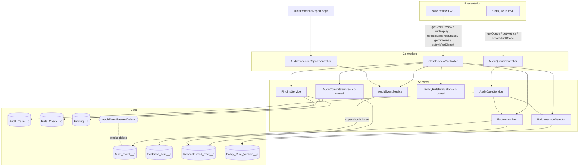

# Solution Architecture: Audit Queue

> [!NOTE]
> **AI-Assisted Documentation**
> Portions of this document were drafted with the assistance of an AI language model.
> Content has not yet been fully reviewed — this is a working design reference, not a final specification.

This document describes the **topology** of the **Audit Queue** — who calls what, how the auditor reaches the system, the layered class structure, the server interface, and how the architectural decisions and risks in [RISKS-AND-DECISIONS.md](RISKS-AND-DECISIONS.md) shape the design.

**See also:** [BLUEPRINT.md](BLUEPRINT.md) · [REQUIREMENTS-MATRIX.md](REQUIREMENTS-MATRIX.md) · [DESIGN-AUDIT-QUEUE.md](DESIGN-AUDIT-QUEUE.md) · [DATA-DICTIONARY.md](DATA-DICTIONARY.md) · [RISKS-AND-DECISIONS.md](RISKS-AND-DECISIONS.md)

---

## Table of Contents

- [1. System Context](#1-system-context)
- [2. Layered View](#2-layered-view)
- [3. Topology Diagram](#3-topology-diagram)
- [4. Interface Catalogue](#4-interface-catalogue)
- [5. Risk → Architecture Traceability](#5-risk--architecture-traceability)
- [6. Key Architectural Constraints](#6-key-architectural-constraints)

---

## 1. System Context

| Aspect | Detail |
|--------|--------|
| **Role** | Internal, read-and-review control surface for mortgage loan QC. Not on any external runtime hot path. |
| **Primary actor** | QC **auditor / reviewer** (an authenticated internal Salesforce user). |
| **Platform** | Salesforce: Lightning Web Components (front end) over an Apex service layer, persisting to 7 custom objects in the Developer-Edition org aliased `mortagate-de`. |
| **Hosting** | Internal **Lightning App Page** (`Audit_Queue_Page`) reached from the App Launcher, per [AD-02](RISKS-AND-DECISIONS.md#ad-02-lightning-app-page-first-community-deferred). Experience Cloud / Community hosting is explicitly post-MVP. |
| **Consumers** | The `auditQueue` LWC (queue) and the case-review LWC (case detail) are the only callers of the Apex `@AuraEnabled` surface. The Visualforce PDF report (`AuditEvidenceReport.page`) is a second, read-only consumer of the audit trail. |
| **Boundary** | Distinct from the separate borrower loan-approval engine; the replay rule engine (`PolicyRuleEvaluator`) is **co-owned** and excluded from the audit-queue deployable unit ([AD-07](RISKS-AND-DECISIONS.md#ad-07-audit-queue-ships-as-its-own-deployable-unit)). |

---

## 2. Layered View

| Layer | Components | Responsibility |
|-------|-----------|----------------|
| **Presentation** | `auditQueue` (LWC) + child components (stat cards, filter bar, datatable with risk sigils); the case-review LWC | Render the queue and case-review experience; client-side sort; invoke the Apex surface. |
| **Application + Controller** | `AuditQueueController`, `CaseReviewController`, `AuditEvidenceReportController` | Thin `@AuraEnabled` / Visualforce controllers exposing the service layer to Lightning / VF. `AuditQueueController` is a passthrough; `CaseReviewController` orchestrates the replay flow. |
| **Domain / Service** | `AuditCaseService`, `AuditEventService`, `FactAssembler`, `FindingService`, `PolicyVersionSelector` *(replay kernel `PolicyRuleEvaluator` + `AuditCommitService` are co-owned, outside this unit)* | Business logic: case lifecycle, append-only event writing, fact reconstruction, finding generation, historical policy selection. |
| **Data** | 7 custom objects (`Audit_Case__c`, `Audit_Event__c`, `Evidence_Item__c`, `Reconstructed_Fact__c`, `Rule_Check__c`, `Finding__c`, `Policy_Rule_Version__c`) + the `AuditEventPreventDelete` trigger + validation rules (`Prevent_Edit_After_Creation`, `Snapshot_Write_Once`, `Prevent_Self_Audit`) | Persistence and platform-enforced integrity. Field detail in [DATA-DICTIONARY.md](DATA-DICTIONARY.md). |

---

## 3. Topology Diagram

---

## 4. Interface Catalogue

The Apex `@AuraEnabled` surface (the LWC's server interface), confirmed by reading the controllers. The Blueprint-named five (`getQueue`, `getCaseReview`, `runReplay`, `updateEvidenceStatus`, `getTimeline`) all exist; `getMetrics`, `createAuditCase`, and `submitForSignoff` are additional methods on the same controllers.

| Method | Controller | Inputs | Output | Notes / governing AD |
|--------|-----------|--------|--------|----------------------|
| `getQueue` | `AuditQueueController` | `filterStatus`, `filterRiskTier`, `filterApproverId`, `filterSamplingReason`, `filterApprovalDays`, `filterAuditorId` (all `String`), `filterDueBefore` (`Date`) | `List<Audit_Case__c>` (Critical-first, `LIMIT 200`) | `cacheable=true`; delegates to `AuditCaseService.getQueue`; injection-safe bind vars + `WITH USER_MODE` (F5, [AD-06](RISKS-AND-DECISIONS.md#ad-06-all-read-paths-enforce-with-user_mode)). |
| `getMetrics` | `AuditQueueController` | none | `Map<String,Integer>` (`assignedToMe`, `highRisk`, `evidenceNeeded`, `readyForSignoff`, `slaAtRisk`) | `cacheable=true`; five `COUNT()` queries, each `WITH USER_MODE`. Backs the 5 stat cards. |
| `createAuditCase` | `AuditQueueController` | `loanApplicationId` (`String`), `samplingReason` (`String`), `originalApproverId` (`String`), `approvalTimestamp` (`Datetime`) | `Audit_Case__c` | Delegates to `AuditCaseService.createFromLoan`; auto-selects historical policy, logs `Case_Created`, seeds evidence shell. |
| `getCaseReview` | `CaseReviewController` | `auditCaseId` (`Id`) | `CaseReviewData` (case + evidence + facts + rule-checks + findings + timeline) | `cacheable=true`; all reads `WITH USER_MODE` (F6, F10, AD-06). |
| `runReplay` | `CaseReviewController` | `auditCaseId` (`Id`) | `CaseReviewData` (refreshed) | Reconstruct → select policy → replay → commit → refresh. Aborts with `AuraHandledException` if no policy resolves (F7). |
| `updateEvidenceStatus` | `CaseReviewController` | `evidenceItemId` (`Id`), `newStatus` (`String`) | `void` | Updates `Evidence_Item__c.Status__c`; appends an `Evidence_Linked` event (F8). |
| `getTimeline` | `CaseReviewController` | `auditCaseId` (`Id`) | `List<Audit_Event__c>` (oldest-first) | `cacheable=true`; delegates to `AuditEventService.getEventsForCase` (F9, AD-06). |
| `submitForSignoff` | `CaseReviewController` | `auditCaseId` (`Id`) | `void` | Blocks if `FindingService.allExceptionsApproved` is false; sets `Status__c = Ready_For_Signoff`; appends `Signoff_Completed` (B6/B7). |

---

## 5. Risk → Architecture Traceability

| Risk | Architectural mitigation in this design |
|------|-----------------------------------------|
| [RK-01](RISKS-AND-DECISIONS.md#rk-01-fix-b-silently-swallows-a-genuine-data-error) — Fix B silently swallows a genuine data error | The graceful-degradation paths (`FactAssembler.queryLoanValues` dynamic-SOQL + try/catch; `CaseReviewController.runReplay` catch block) are localized in the service/controller layer and paired with named `System.debug` logging + an inline "some fields unavailable" notice so a swallowed error stays observable. Governed by [AD-01](RISKS-AND-DECISIONS.md#ad-01-fls-gap-closed-by-graceful-degradation-not-a-permission-set). |
| [RK-02](RISKS-AND-DECISIONS.md#rk-02-de-governor-limits-during-a-broad-filter-query) — DE governor limits on a broad query | `AuditCaseService.getQueue` enforces selective `WHERE` (bind-var conditions) + `LIMIT 200` with Critical-first ordering; `getMetrics` uses aggregate `COUNT()` queries (no row materialization). Keeps the queue read within DE limits. |
| [RK-03](RISKS-AND-DECISIONS.md#rk-03-app-not-visible-to-the-demo-user-profile) — App not visible to the demo profile | Hosting choice (Lightning App Page `Audit_Queue_Page`, [AD-02](RISKS-AND-DECISIONS.md#ad-02-lightning-app-page-first-community-deferred)) keeps surface inside the platform sidebar; mitigation is a Phase-2 profile assignment of `Audit_Queue_App` verified by logging in as the demo user. |
| [RK-04](RISKS-AND-DECISIONS.md#rk-04-styling-pass-regresses-the-table) — Styling pass regresses the table | Presentation layer is isolated: risk sigils are CSS `::before` decorations, leaving the LWC data model (`type:'text'` columns) untouched ([AD-03](RISKS-AND-DECISIONS.md#ad-03-brand-accurate-styling-not-pixel-match)); the Jest contract locks the column types green. |
| [RK-05](RISKS-AND-DECISIONS.md#rk-05-demo-environment-state-drift) — Demo environment state drift | Stateless controllers + `cacheable=true` reads make the queue reproducible from a clean filter state; mitigated operationally by the three-step reset runbook (clear filters → default view → confirm AC-0001). |

---

## 6. Key Architectural Constraints

- **MUST** run every read on the evidence/audit surface `WITH USER_MODE` (or `Database.query(..., AccessLevel.USER_MODE)`) so FLS/CRUD is enforced for the running user (AD-06).
- **MUST** build dynamic SOQL from hardcoded field-name literals + bind variables only — no string interpolation of client input (F5).
- **MUST NOT** update or delete `Audit_Event__c`; corrections are appended as new events (`Correction` type) — enforced by VR `Prevent_Edit_After_Creation` + trigger `AuditEventPreventDelete` (F11, AD-05).
- **MUST NOT** re-derive `Borrower_Name_Snapshot__c` live; bind to the write-once snapshot (F12, AD-04).
- **MUST** abort `runReplay` with an `AuraHandledException` if no historical policy version resolves — no silent default (F7).
- **MUST** keep the audit queue independently deployable, gated on its own `AuditQueue` test suite, excluding the co-owned `PolicyRuleEvaluator` from the package manifest (AD-07).
